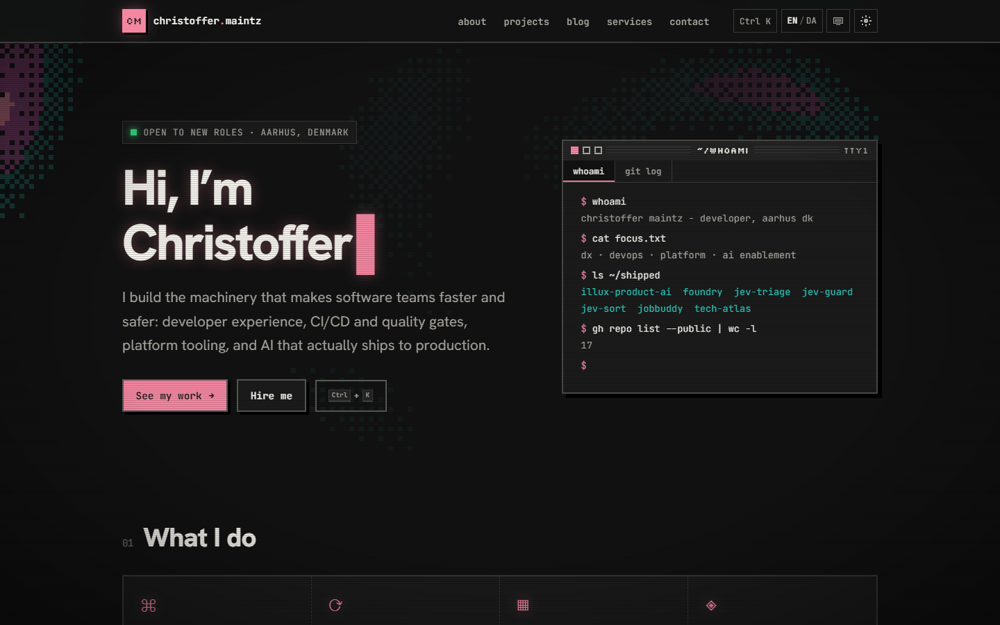

# cmaintz-site

My personal site: projects, blog, CV, services and contact, in English and Danish. Astro on Cloudflare Workers, dressed up in a retro CRT look.

Live at https://maintz.dev. (If you find the Konami code works, that's on purpose.)



```sh
npm install
npm run dev        # http://localhost:4321
npm run build      # site + search index -> dist/
npm run preview    # Workers runtime locally
npm run check      # types, code-size rules (functions <= 18 lines, files <= 300), comments SQL tests
npm run shots      # screenshot smoke test (desktop + mobile)
npm test           # unit tests (Vitest); npm run test:coverage for coverage
npm run smoke      # interaction smoke test against the build (Playwright)
```

Domain, deploy, contact form, comments, analytics and content workflows are in [SETUP.md](SETUP.md).

## Where things live

| Path                        | What                                                                 |
| --------------------------- | -------------------------------------------------------------------- |
| `src/content/projects/*.md` | Project case studies (frontmatter schema in `src/content.config.ts`) |
| `src/content/blog/*.mdx`    | Blog posts                                                           |
| `src/data/resume.ts`        | CV data (drives /about, /cv and the PDFs)                            |
| `src/data/services.ts`      | Services and pricing                                                 |
| `src/data/site.ts`          | Name, email, socials                                                 |
| `src/data/github.json`      | GitHub snapshot (`npm run sync`)                                     |
| `src/i18n/ui.ts`            | English/Danish UI strings                                            |
| `src/views/`                | Page bodies shared by `/x` and `/da/x` routes                        |
| `src/styles/global.css`     | Retro design tokens and primitives                                   |
| `scripts/`                  | GitHub sync, CV PDF, OG image, screenshots, function-length check    |

## License

MIT, see [LICENSE](LICENSE).
