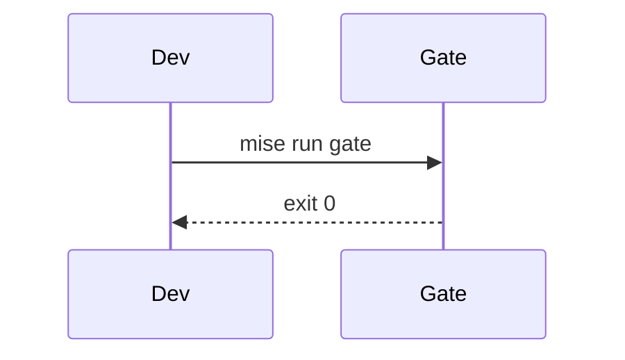

import Callout from '../../components/Callout.astro';

This is the first post on my new site, and it's going to be a home for a bit of everything. Notes on developer tooling, CI and quality gates, platform work and building with AI, sure. But also my ramblings, the occasional rant, and the extended versions of things I post on LinkedIn and elsewhere, for when a few paragraphs just aren't enough.

## Why it looks like this

I've always loved the retro-futuristic technology of Alien, Blade Runner and the like. The scanlines, the bloom of a CRT, chunky terminals with a blinking cursor, screens that look like they were built to be used rather than admired. So that's what this site is built around: old-school windows and a pixelated field humming in the background, with thoroughly modern plumbing underneath. (Behind longer text like this, the scanlines politely step aside, so it stays readable.)

## Under the hood

The site is built with [Astro](https://astro.build) and runs on Cloudflare's edge. Project pages pull their data straight from my GitHub repositories when the site is built: languages, stars, topics and the READMEs themselves, so nothing drifts out of date. Everything is in English and Danish, and it's all checked by the same kind of deterministic quality gate I'd put on any team's code.

I wanted proper tooling for technical writing, so posts here support code with titles, highlighted lines and diffs:

```ts title="src/lib/content.ts" {3}
export function repo(name: string) {
  const r = snapshot.repos.find((x) => x.name === name);
  if (!r) throw new Error(`Unknown repo: ${name}`);
  return r;
}
```

```diff lang="yaml"
- uses: actions/checkout@v4
+ uses: actions/checkout@8e5e7e5ab8b370d6c329ec480221332ada57f0ab # v5
```

Maths, inline like $O(n \log n)$ or as a block:

$$
\text{cost} = \sum_{i=1}^{n} p_i \cdot c_i
$$

Diagrams written as plain text:



<Callout type="tip" title="And callouts">
  For the bits that deserve to stand out.
</Callout>

## Things worth poking at

A few details I had far too much fun building:

- **A command palette.** Press <kbd>Ctrl</kbd> + <kbd>K</kbd> (<kbd>⌘</kbd> + <kbd>K</kbd> on a Mac) anywhere. Fuzzy search across every page, project and post, arrow keys to pick, <kbd>Tab</kbd> to complete.
- **A terminal that's actually a (tiny) shell.** The one on the front page types itself out, but the last prompt takes input. Try `help`.
- **Comments with a conscience.** Sign in with GitHub or Google, and only your initials are ever stored or shown. Your name never leaves the sign-in.
- **A secret or two.** Some of them are older than the web itself.

More soon.
