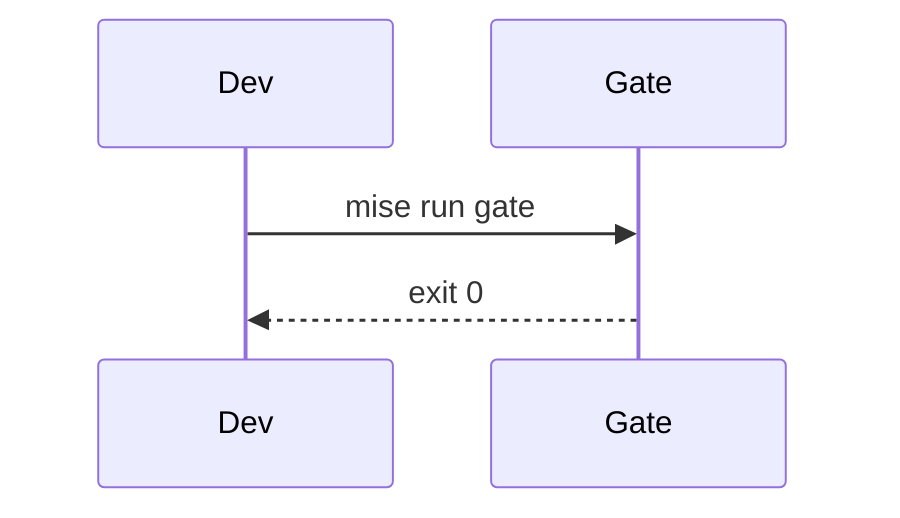

import Callout from '../../components/Callout.astro';

This is the first post on the new site. It'll be a place for notes on developer tooling, CI and quality gates, platform work, and building things with AI - the stuff I spend most of my time on.

The site itself is built with [Astro](https://astro.build), deployed on Cloudflare, and pulls project data straight from my GitHub repositories at build time. The retro look is deliberate: old-school boxes and a pixelated background, paired with modern typography and interactions.

## What posts can do

Code, with titles, line markers and diffs:

```ts title="src/lib/github.ts" {3}
export function repo(name: string) {
  const r = snapshot.repos.find((x) => x.name === name);
  if (!r) throw new Error(`Unknown repo: ${name}`);
  return r;
}
```

```diff lang="yaml"
- uses: actions/checkout@v4
+ uses: actions/checkout@8e5e7e5ab8b370d6c329ec480221332ada57f0ab # v5
```

Math, inline like $O(n \log n)$ or as a block:

$$
\text{cost} = \sum_{i=1}^{n} p_i \cdot c_i
$$

Diagrams, written as text:



And callouts:

<Callout type="tip" title="Tip">
Press <kbd>Ctrl</kbd> + <kbd>K</kbd> (or <kbd>⌘</kbd> + <kbd>K</kbd>) anywhere on the site to open the command palette.
</Callout>

<Callout type="warn">
The CRT effects can be switched off from the palette or the toggle in the header.
</Callout>

More soon.
