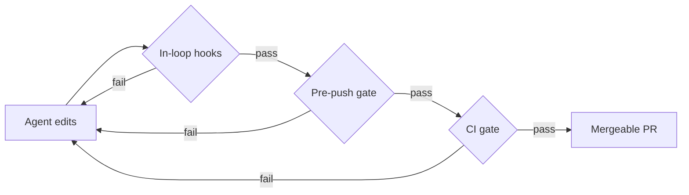

import Callout from '../../components/Callout.astro';

A CI pipeline and a set of "AI coding standards" usually get built as two separate things - and then they slowly disagree. The pipeline checks one thing, the agent's instructions say another, and your pre-push hook is a third opinion nobody remembers writing.

[Foundry](/projects/foundry) starts from a different premise: **they're one rule set in three placements.**

| Placement | When it runs | Feedback goes to | Cost |
| --- | --- | --- | --- |
| In-loop | while the AI agent edits | the agent, mid-task | free |
| Pre-push | before code leaves the machine | the human | free |
| CI | on every pull request | the permanent record | free tier |

Run *different* rules in each and you get the classic "passes locally, fails in CI". With agents you also get something worse: the agent fixes what the hook flagged, CI complains about something else, the agent fixes that and regresses the first. One rule set, three placements - no drift, no thrash.

## Deterministic is the oracle

The first load-bearing idea: **only deterministic tools decide pass/fail.** Formatters, linters, type checkers, tests with coverage floors, and security scanners. An LLM is allowed to *propose* a patch; the patch is accepted only if the gate then passes from a clean tree.

<Callout type="note" title="The exit code is the evidence">
"The model says it fixed it" is not evidence. The exit code is.
</Callout>

That also means splitting the AI into roles people usually conflate: a **Fixer** that produces bounded patches, a **Reviewer** that is advisory and never blocks, and a **Triager** that separates flaky from real.



## Verbs, not tools

Every repo, whatever the language, exposes the same six verbs through [mise](https://mise.jdx.dev), which also pins the toolchain:

```sh title="the whole interface"
mise run fix        # auto-fix what is mechanically fixable
mise run lint       # style + structural smells
mise run typecheck  # static types
mise run test       # tests + coverage floor
mise run audit      # vulnerabilities, secrets, SAST
mise run gate       # all of the above, in order - the oracle
```

CI, git hooks and agent skills all call **verbs, never tools**. A skill says `mise run lint`, never `eslint` or `phpstan`. That one indirection is why a single skill library can serve a React repo and a Kotlin repo: the smell vocabulary - `oversized-function`, `high-complexity`, `deep-nesting` - means the same thing everywhere; only the detector behind the verb changes.

## Ratchet, don't gate

Bolt strict linters onto a real codebase and everything is red on day one. You abandon it in week two. So instead, existing violations become a **baseline that may only shrink**. Fix a violation and it's pruned for good; add a new one and the gate fails.

If $n_t$ is the number of baselined violations at commit $t$, the only invariant the gate enforces is:

$$
n_{t+1} \le n_t
$$

The cheapest way to satisfy a linter is to weaken the rule, so a small `ruleset-guard` refuses any PR that touches both a ruleset *and* production source unless a human labels it deliberate. It's tightening-aware: loosening needs a human, tightening sails through.

## What I'd tell a team adopting this

1. Pick the verbs first. Tools come and go; the interface is what your hooks, CI and agents depend on.
2. Baseline everything on day one, then let the ratchet do the work.
3. Keep the AI out of the pass/fail decision. Let it propose; let the exit code decide.

The code is on GitHub: [CMaintz/foundry](https://github.com/CMaintz/foundry) and [CMaintz/cmaintz-skills](https://github.com/CMaintz/cmaintz-skills).
